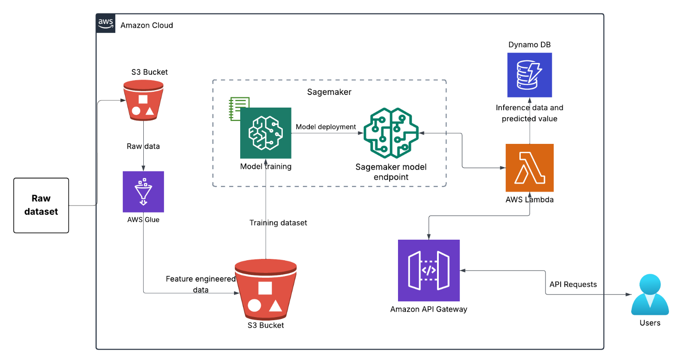
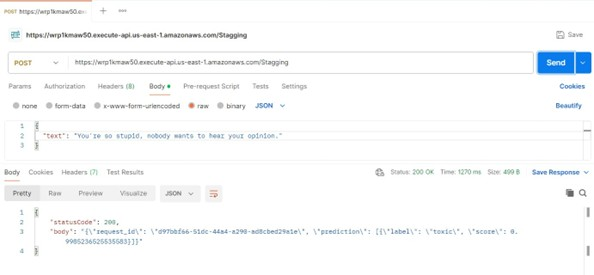

# 🧠 AI-Powered Meme Toxicity Classifier

This project presents a cloud-native AI solution to detect **toxic text in memes** using a fine-tuned **DistilBERT** model. It leverages AWS services to create a scalable, real-time inference system for content moderation on social media platforms.

---

## 🚀 Features

- 💬 Detects toxicity in meme text using NLP
- 🔍 Fine-tuned DistilBERT with Hugging Face on SageMaker
- ☁️ Fully serverless architecture using AWS (S3, Glue, SageMaker, Lambda, API Gateway, DynamoDB)
- ⚡ Real-time inference with REST API
- 📈 Scalable infrastructure using auto-scaling, monitoring, and multi-model endpoints

---

## 🧱 Architecture Overview

            +-------------+
            |   User/API  |
            +------+------+
                   |
         +---------v---------+
         |  API Gateway      |
         +---------+---------+
                   |
             +-----v-----+
             |  Lambda   |
             +-----+-----+
                   |
          +--------v--------+
          | SageMaker Model |
          +--------+--------+
                   |
            +------v------+
            |  DynamoDB   |
            +-------------+

> Data is stored in Amazon S3, processed via AWS Glue, trained using Hugging Face on SageMaker, and served via Lambda/API Gateway.

---

## 📂 Project Structure

```

meme-toxicity-classifier/
│
├── README.md                 # Project overview
├── requirements.txt          # Python dependencies
├── .gitignore                # Ignore logs, models, etc.
│
├── notebooks/
│   └── meme\_classification.ipynb  # EDA and testing
│
├── src/
│   ├── train.py              # Training script for DistilBERT
│   ├── aws\_glue.py           # AWS Glue ETL transformation
│   └── lambdafunction.py     # Lambda function to call model
│
├── architecture/
│   ├── architecture\_diagram.png  # AWS architecture
│   └── postman\_demo.png          # Screenshot of API test

````

---

## 🔧 Setup & Deployment

### 1. Install dependencies

```bash
pip install -r requirements.txt
````

### 2. Prepare data

* Upload [Jigsaw Toxic Comment Dataset](https://www.kaggle.com/c/jigsaw-toxic-comment-classification-challenge) to an S3 bucket.
* Run `aws_glue.py` via AWS Glue to preprocess and clean the data.

### 3. Train the model (SageMaker)

```python
from sagemaker.huggingface import HuggingFace

huggingface_estimator = HuggingFace(
    entry_point='train.py',
    source_dir='src',
    instance_type='ml.m5.xlarge',
    instance_count=1,
    role='<IAM_ROLE>',
    transformers_version='4.6',
    pytorch_version='1.7',
    py_version='py36'
)

huggingface_estimator.fit()
```

### 4. Deploy the model

```python
predictor = huggingface_estimator.deploy(
    initial_instance_count=1,
    instance_type="ml.m5.xlarge",
    endpoint_name="toxic-meme-classifier"
)
```

### 5. Real-Time Inference via API Gateway

```json
POST /predict
{
  "inputs": ["Hey, you are so stupid. I feel like beating you up"]
}
```

**Response:**

```json
[
  { "label": "toxic", "score": 0.9995 }
]
```

---

## 📊 Model Performance

| Epoch | Validation Loss | Accuracy |
| ----- | --------------- | -------- |
| 1     | 0.0901          | 96.60%   |
| 2     | 0.0962          | 96.67%   |
| 3     | 0.1203          | 96.75%   |

---

## ⚙️ Scalability Highlights

* **Auto Scaling**: Based on CPU/memory/invocations
* **Multi-Model Endpoints**: Deploy multiple models in one container
* **Monitoring**: Detect concept/data drift using SageMaker Model Monitor
* **Load Testing**: Use SageMaker Inference Recommender to optimize instance selection

---

## 📸 Demo

### Architecture Diagram



### Postman API Example



---

## 📦 Requirements

```
boto3
transformers
sagemaker
awswrangler
pandas
numpy
```

---

## 👩‍💻 Author

**Iqra Bano**
AI & Machine Learning Engineer
[LinkedIn](https://www.linkedin.com/in/iqra-bano/) | [GitHub](https://github.com/iqra-1)

---

## 📄 License

This project is licensed under the [MIT License](LICENSE).

